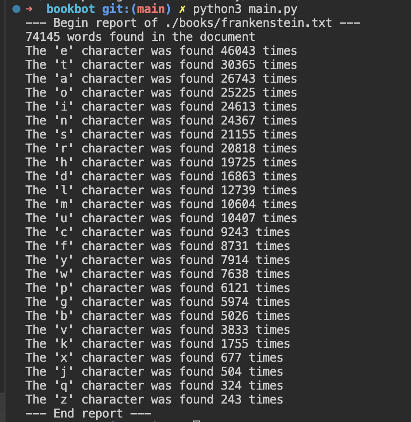

# bookbot

BookBot is my first python project!.

It is a simple bot that can be used to display the count of all alhabet characters from a text or book.

## Set up
* Have [python 3](https://www.python.org/downloads/) installed in your environment
* Clone this repository
* Open application IDE of choice
* Create `book/` directory
* add text document you wish to analyse in `.txt` format

## Generate report
* run `python3 main.py` and view the analysis on the console.